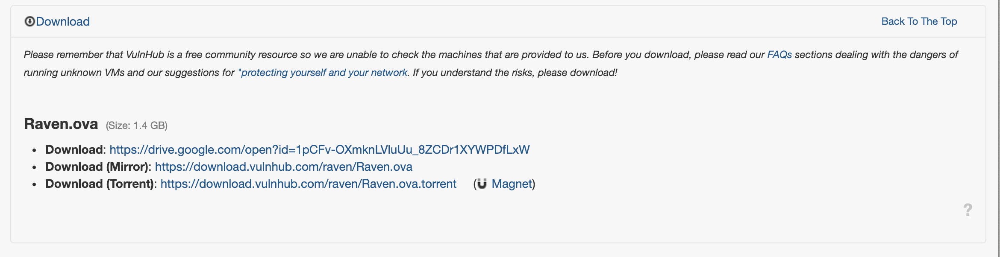
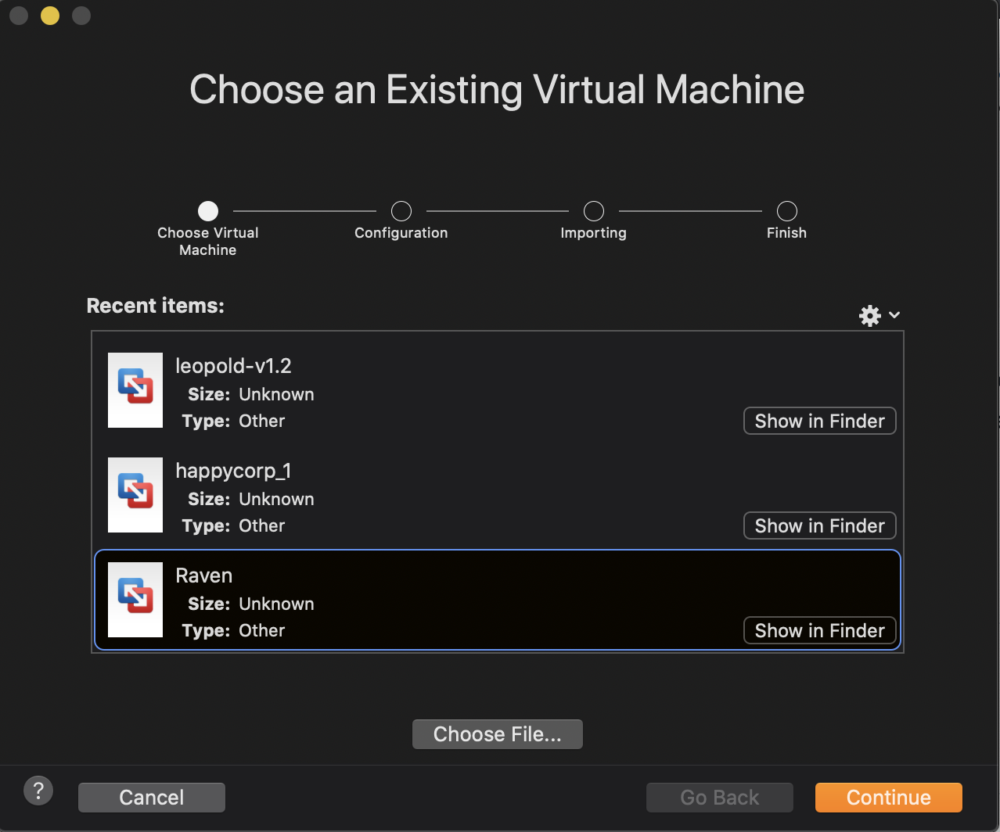
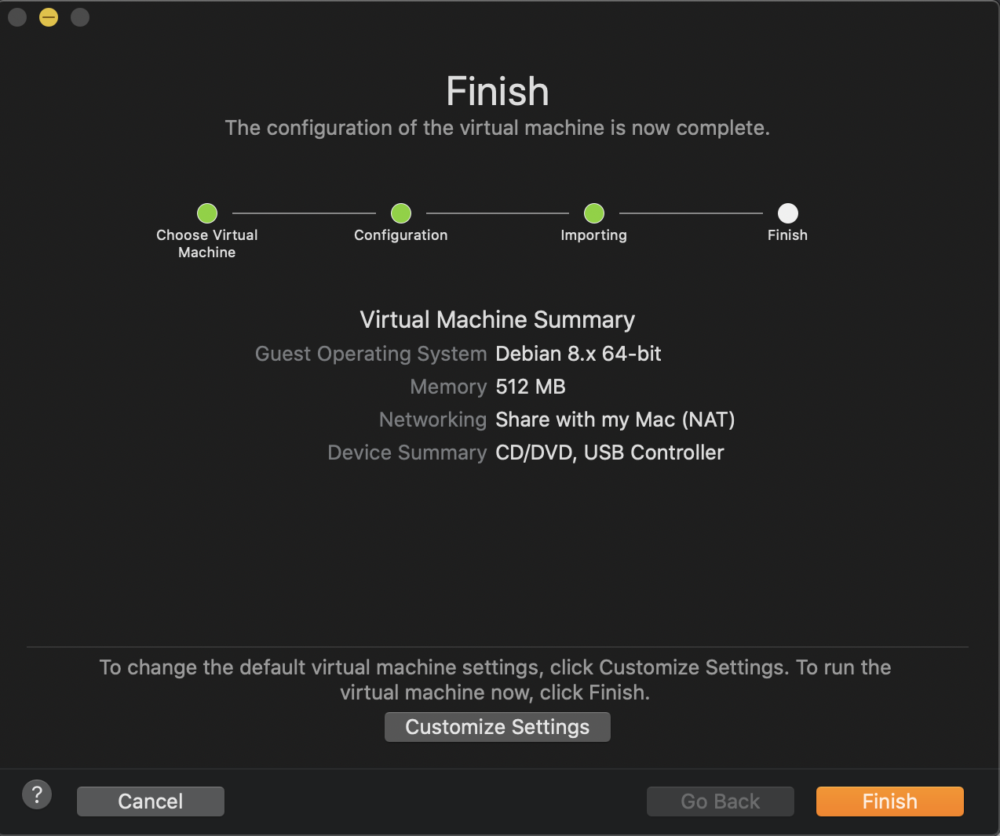
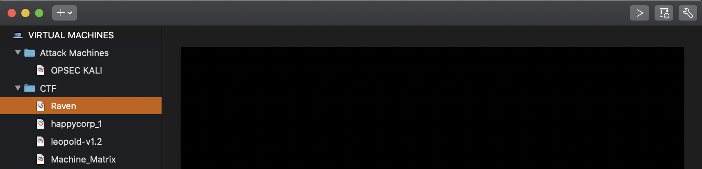

# Vulnhub

## Overview

Vulnhub is synonymous with Capture the Flag. For years, the website and CTF archive repository has served as a cornerstone of the community by providing a central platform to host Boot 2 Root CTF Virtual Machines. Started and maintained by an infosec legend in their own right, [g0tmi1k](https://blog.g0tmi1k.com/), the site is an open source repository of hundreds of CTF  vm's ready for download. 

## Picking a VulHub CTF

The first two considerations you should make when picking a challenge on Vulnhub are Platform and Difficulty. All VMs on the platform require either VMware or Virtual Box to run. For information on setting up a [Dedicated Virtual Machine, click the link here.](../../getting-started/choosing-your-challenge-kit/dedicated-virtual-machine/)

#### A Statement About Security 


As stated on the Vulnhub website, VMs hosted on the platform are not checked to determine if they contain malicious code. 

_"Please remember that VulnHub is a free community resource so we are unable to check the machines that are provided to us. Before you download, please read our_ [_FAQs_](https://www.vulnhub.com/faq/#security) _sections dealing with the dangers of running unknown VMs and our suggestions for_ [_"protecting yourself and your network_](https://www.vulnhub.com/faq/#protect)_. If you understand the risks, please download!" ~ vulnhub_


#### Google Dorking for Difficulty Level, VM Type, or Topic

You can use google dork queries to find CTFs based on experience level. For example, you can use the following query to find beginner level challenges

```text
site:*vulnhub.com intext:begginner
```

If you decide to use either Virtual Box or VMWare to host your CTF, you can use google dork queries to search for challenges specific to your platform. 

```http
site:*vulnhub.com intext:virtualbox
```

Likewise, you can search for specific terms. For example, if your interested in OSCP-like CTF's, you can use the command intext:OSCP. 

```http
site:*vulnhub.com intext:OSCP
```

#### Searching Through Upload History

To see all CTF's hosted on Vulnhub, you can browse the timeline page.



## Downloading a VM

This step will differ depending on your chosen Virtualization Software. The steps below are written for Mac OSX, but should be very similar for windows and other host operating systems. 


Vulnhub CTF Installation Tutorial : [Raven CTF](https://www.vulnhub.com/entry/raven-1,256/)


### VMWare

This tutorial will be based on the [Raven CTF](https://www.vulnhub.com/entry/raven-1,256/), but will be the same across challenges. On the main vulnhub page for your chosen CTF, locate the Download section and download the CTF with extension\*.OVA.  Some CTFs can be larger in size, most are typically within the .5 - 1.5 GB range. 



Once the ova images is downloaded it, is is suggested to move to a dedicated folder for vm's. For example Documents/CTF/VMs. At this point, you can right click the image, and select "Open with VMWare"



Select Continue. VMWare will save the file with the \*vmwarevm extension. Select Finish



On the main menu for VMWare, you should be able to see the new CTF as a VM. You can group VMs together according to category and put them in corresponding folders like CTFs and Attack Machines. Changing a VM folder here will not change the actual location of the image on your system. 



## Configuring DCHP

## Getting Started

## Cleaning Up

## Submitting a CTF to Vulnhub

## 

