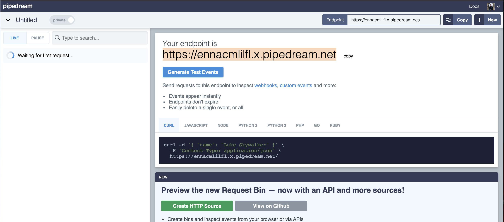

# Stealing Cookies

## Overview

Many websites use [cookies](https://kb.iu.edu/d/agwm) to authenticate users or to keep track of users across the application after authentication has occurred. Cookies can correlate to a specific user id, and lets the server know what authority the user has to access resources or make changes. 

Often, the use of stealing cookies in the context of a CTF involves escalating privilege from a normal user account to that of an admin. This could involve stealing the cookie of an authenticated admin in order to gain the privilege of that user. To do  so, one might exploit a cross site scripting attack, or XSS, in which an administrator or other user can be tricked to clicking a link which sends the attacker his or her cookies. Read more about XSS [here](./).

## Guide to Stealing Cookies

Stealing cookies is a _server side_ attack. This means that aside from the CTF player, another user has to be interacted with to trigger the vulnerability. In CTF context, this   could mean interacting with the CTF organizers/facilitators, or it could mean the organizers have set up some kind of automated process. An example of an automated process would be automated actions on [Selenium](https://www.selenium.dev/). 

### Step 1, Find a [XSS Vulnerability ](./)

To find an [XSS vulnerability](./), you often need to test input fields on a webpage. These can be comment boxes, input forms, or anywhere else you can submit text to the server. Below are some good resources for testing various inputs which _might_ trigger an [XSS vulnerability](./). 





### Step 2, Create Payload

To effectively steal another user's cookie, your payload needs to do two things; it needs to collect a session cookie, and it needs to display the cookie so you can see it. The later of the two steps is different depending if you are competing in a local network CTF or one hosted over the internet. 

#### Local Network Payload

A local network CTF can be defined as a CTF in which the target CTF application and your attack machine are on the same network. These can include a [VulnHub](../../../types/boot-2-root/vulnhub.md) [boot 2 root](../../../types/boot-2-root/) challenge where you are running the CTF and your attack machine in the same virtualization software. Payloads in a local network need to send cookies _directly_  to your attack machine. An easy way to accomplish this is with netcat. 

#### Netcat 

Start a netcat listener on port 80 . Once started, the payload for the XSS exploit should point directly to your attack machine's local ip and port 80.

```bash
nc -lnvp 80
```

An example payload might look like this. \([source](https://security.stackexchange.com/questions/49185/xss-cookie-stealing-without-redirecting-to-another-page)\)

```markup

```

#### Stealing Cookies over the Internet

When competing in an online event, a local netcat listener will not work. Instead of directing the cookie locally, you can direct it to a resource you own on the internet. One of these best ways this can be done is with requestbin and pipedream

#### Sign up for a free requestbin account



Once signed in, your first endpoint will be automatically generated for you. On the middle of the endpoint dashboard, select the create http source button. This will take you over to pipedream, a site where you can see live requests to your endpoint url. 



On the pipedream dashboard, you will see a new endpoint url. This is the target that you will want to use in your XSS payload when stealing cookies, however, instead of a netcat listener receiving the connection request and credentials, you will see requests through the pipedream dashboard.

### Step 3: Triggering the Exploit

The final step after identifying an XSS vulnerability, crafting the payload, and preparing to receive a connection, is to get another users to trigger the exploit. Depending on the CTF, this might be done by "submitting" your payload to the CTF server, and some automated process using software like selenium might trigger the XSS and send the request back to your endpoint.  

